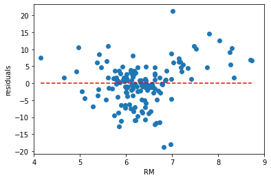

# 引入資料檔


```python
from sklearn.datasets import load_boston
boston_datasets = load_boston()
```

# 引入報表


```python
import pandas as pd
boston = pd.DataFrame(boston_datasets.data,columns=boston_datasets.feature_names)
boston['MEDV'] = boston_datasets.target
boston
```


<div>
<style scoped>
    .dataframe tbody tr th:only-of-type {
        vertical-align: middle;
    }

    .dataframe tbody tr th {
        vertical-align: top;
    }

    .dataframe thead th {
        text-align: right;
    }
</style>
<table border="1" class="dataframe">
  <thead>
    <tr style="text-align: right;">
      <th></th>
      <th>CRIM</th>
      <th>ZN</th>
      <th>INDUS</th>
      <th>CHAS</th>
      <th>NOX</th>
      <th>RM</th>
      <th>AGE</th>
      <th>DIS</th>
      <th>RAD</th>
      <th>TAX</th>
      <th>PTRATIO</th>
      <th>B</th>
      <th>LSTAT</th>
      <th>MEDV</th>
    </tr>
  </thead>
  <tbody>
    <tr>
      <th>0</th>
      <td>0.00632</td>
      <td>18.0</td>
      <td>2.31</td>
      <td>0.0</td>
      <td>0.538</td>
      <td>6.575</td>
      <td>65.2</td>
      <td>4.0900</td>
      <td>1.0</td>
      <td>296.0</td>
      <td>15.3</td>
      <td>396.90</td>
      <td>4.98</td>
      <td>24.0</td>
    </tr>
    <tr>
      <th>1</th>
      <td>0.02731</td>
      <td>0.0</td>
      <td>7.07</td>
      <td>0.0</td>
      <td>0.469</td>
      <td>6.421</td>
      <td>78.9</td>
      <td>4.9671</td>
      <td>2.0</td>
      <td>242.0</td>
      <td>17.8</td>
      <td>396.90</td>
      <td>9.14</td>
      <td>21.6</td>
    </tr>
    <tr>
      <th>2</th>
      <td>0.02729</td>
      <td>0.0</td>
      <td>7.07</td>
      <td>0.0</td>
      <td>0.469</td>
      <td>7.185</td>
      <td>61.1</td>
      <td>4.9671</td>
      <td>2.0</td>
      <td>242.0</td>
      <td>17.8</td>
      <td>392.83</td>
      <td>4.03</td>
      <td>34.7</td>
    </tr>
    <tr>
      <th>3</th>
      <td>0.03237</td>
      <td>0.0</td>
      <td>2.18</td>
      <td>0.0</td>
      <td>0.458</td>
      <td>6.998</td>
      <td>45.8</td>
      <td>6.0622</td>
      <td>3.0</td>
      <td>222.0</td>
      <td>18.7</td>
      <td>394.63</td>
      <td>2.94</td>
      <td>33.4</td>
    </tr>
    <tr>
      <th>4</th>
      <td>0.06905</td>
      <td>0.0</td>
      <td>2.18</td>
      <td>0.0</td>
      <td>0.458</td>
      <td>7.147</td>
      <td>54.2</td>
      <td>6.0622</td>
      <td>3.0</td>
      <td>222.0</td>
      <td>18.7</td>
      <td>396.90</td>
      <td>5.33</td>
      <td>36.2</td>
    </tr>
    <tr>
      <th>...</th>
      <td>...</td>
      <td>...</td>
      <td>...</td>
      <td>...</td>
      <td>...</td>
      <td>...</td>
      <td>...</td>
      <td>...</td>
      <td>...</td>
      <td>...</td>
      <td>...</td>
      <td>...</td>
      <td>...</td>
      <td>...</td>
    </tr>
    <tr>
      <th>501</th>
      <td>0.06263</td>
      <td>0.0</td>
      <td>11.93</td>
      <td>0.0</td>
      <td>0.573</td>
      <td>6.593</td>
      <td>69.1</td>
      <td>2.4786</td>
      <td>1.0</td>
      <td>273.0</td>
      <td>21.0</td>
      <td>391.99</td>
      <td>9.67</td>
      <td>22.4</td>
    </tr>
    <tr>
      <th>502</th>
      <td>0.04527</td>
      <td>0.0</td>
      <td>11.93</td>
      <td>0.0</td>
      <td>0.573</td>
      <td>6.120</td>
      <td>76.7</td>
      <td>2.2875</td>
      <td>1.0</td>
      <td>273.0</td>
      <td>21.0</td>
      <td>396.90</td>
      <td>9.08</td>
      <td>20.6</td>
    </tr>
    <tr>
      <th>503</th>
      <td>0.06076</td>
      <td>0.0</td>
      <td>11.93</td>
      <td>0.0</td>
      <td>0.573</td>
      <td>6.976</td>
      <td>91.0</td>
      <td>2.1675</td>
      <td>1.0</td>
      <td>273.0</td>
      <td>21.0</td>
      <td>396.90</td>
      <td>5.64</td>
      <td>23.9</td>
    </tr>
    <tr>
      <th>504</th>
      <td>0.10959</td>
      <td>0.0</td>
      <td>11.93</td>
      <td>0.0</td>
      <td>0.573</td>
      <td>6.794</td>
      <td>89.3</td>
      <td>2.3889</td>
      <td>1.0</td>
      <td>273.0</td>
      <td>21.0</td>
      <td>393.45</td>
      <td>6.48</td>
      <td>22.0</td>
    </tr>
    <tr>
      <th>505</th>
      <td>0.04741</td>
      <td>0.0</td>
      <td>11.93</td>
      <td>0.0</td>
      <td>0.573</td>
      <td>6.030</td>
      <td>80.8</td>
      <td>2.5050</td>
      <td>1.0</td>
      <td>273.0</td>
      <td>21.0</td>
      <td>396.90</td>
      <td>7.88</td>
      <td>11.9</td>
    </tr>
  </tbody>
</table>
<p>506 rows × 14 columns</p>
</div>


# ANOVA 表


```python
boston[['CHAS','RM','AGE','RAD','MEDV']].head()
```


<div>
<style scoped>
    .dataframe tbody tr th:only-of-type {
        vertical-align: middle;
    }

    .dataframe tbody tr th {
        vertical-align: top;
    }

    .dataframe thead th {
        text-align: right;
    }
</style>
<table border="1" class="dataframe">
  <thead>
    <tr style="text-align: right;">
      <th></th>
      <th>CHAS</th>
      <th>RM</th>
      <th>AGE</th>
      <th>RAD</th>
      <th>MEDV</th>
    </tr>
  </thead>
  <tbody>
    <tr>
      <th>0</th>
      <td>0.0</td>
      <td>6.575</td>
      <td>65.2</td>
      <td>1.0</td>
      <td>24.0</td>
    </tr>
    <tr>
      <th>1</th>
      <td>0.0</td>
      <td>6.421</td>
      <td>78.9</td>
      <td>2.0</td>
      <td>21.6</td>
    </tr>
    <tr>
      <th>2</th>
      <td>0.0</td>
      <td>7.185</td>
      <td>61.1</td>
      <td>2.0</td>
      <td>34.7</td>
    </tr>
    <tr>
      <th>3</th>
      <td>0.0</td>
      <td>6.998</td>
      <td>45.8</td>
      <td>3.0</td>
      <td>33.4</td>
    </tr>
    <tr>
      <th>4</th>
      <td>0.0</td>
      <td>7.147</td>
      <td>54.2</td>
      <td>3.0</td>
      <td>36.2</td>
    </tr>
  </tbody>
</table>
</div>


# 各數字的總計量


```python
boston.describe().round(2)
```


<div>
<style scoped>
    .dataframe tbody tr th:only-of-type {
        vertical-align: middle;
    }

    .dataframe tbody tr th {
        vertical-align: top;
    }

    .dataframe thead th {
        text-align: right;
    }
</style>
<table border="1" class="dataframe">
  <thead>
    <tr style="text-align: right;">
      <th></th>
      <th>CRIM</th>
      <th>ZN</th>
      <th>INDUS</th>
      <th>CHAS</th>
      <th>NOX</th>
      <th>RM</th>
      <th>AGE</th>
      <th>DIS</th>
      <th>RAD</th>
      <th>TAX</th>
      <th>PTRATIO</th>
      <th>B</th>
      <th>LSTAT</th>
      <th>MEDV</th>
    </tr>
  </thead>
  <tbody>
    <tr>
      <th>count</th>
      <td>506.00</td>
      <td>506.00</td>
      <td>506.00</td>
      <td>506.00</td>
      <td>506.00</td>
      <td>506.00</td>
      <td>506.00</td>
      <td>506.00</td>
      <td>506.00</td>
      <td>506.00</td>
      <td>506.00</td>
      <td>506.00</td>
      <td>506.00</td>
      <td>506.00</td>
    </tr>
    <tr>
      <th>mean</th>
      <td>3.61</td>
      <td>11.36</td>
      <td>11.14</td>
      <td>0.07</td>
      <td>0.55</td>
      <td>6.28</td>
      <td>68.57</td>
      <td>3.80</td>
      <td>9.55</td>
      <td>408.24</td>
      <td>18.46</td>
      <td>356.67</td>
      <td>12.65</td>
      <td>22.53</td>
    </tr>
    <tr>
      <th>std</th>
      <td>8.60</td>
      <td>23.32</td>
      <td>6.86</td>
      <td>0.25</td>
      <td>0.12</td>
      <td>0.70</td>
      <td>28.15</td>
      <td>2.11</td>
      <td>8.71</td>
      <td>168.54</td>
      <td>2.16</td>
      <td>91.29</td>
      <td>7.14</td>
      <td>9.20</td>
    </tr>
    <tr>
      <th>min</th>
      <td>0.01</td>
      <td>0.00</td>
      <td>0.46</td>
      <td>0.00</td>
      <td>0.38</td>
      <td>3.56</td>
      <td>2.90</td>
      <td>1.13</td>
      <td>1.00</td>
      <td>187.00</td>
      <td>12.60</td>
      <td>0.32</td>
      <td>1.73</td>
      <td>5.00</td>
    </tr>
    <tr>
      <th>25%</th>
      <td>0.08</td>
      <td>0.00</td>
      <td>5.19</td>
      <td>0.00</td>
      <td>0.45</td>
      <td>5.89</td>
      <td>45.02</td>
      <td>2.10</td>
      <td>4.00</td>
      <td>279.00</td>
      <td>17.40</td>
      <td>375.38</td>
      <td>6.95</td>
      <td>17.02</td>
    </tr>
    <tr>
      <th>50%</th>
      <td>0.26</td>
      <td>0.00</td>
      <td>9.69</td>
      <td>0.00</td>
      <td>0.54</td>
      <td>6.21</td>
      <td>77.50</td>
      <td>3.21</td>
      <td>5.00</td>
      <td>330.00</td>
      <td>19.05</td>
      <td>391.44</td>
      <td>11.36</td>
      <td>21.20</td>
    </tr>
    <tr>
      <th>75%</th>
      <td>3.68</td>
      <td>12.50</td>
      <td>18.10</td>
      <td>0.00</td>
      <td>0.62</td>
      <td>6.62</td>
      <td>94.07</td>
      <td>5.19</td>
      <td>24.00</td>
      <td>666.00</td>
      <td>20.20</td>
      <td>396.22</td>
      <td>16.96</td>
      <td>25.00</td>
    </tr>
    <tr>
      <th>max</th>
      <td>88.98</td>
      <td>100.00</td>
      <td>27.74</td>
      <td>1.00</td>
      <td>0.87</td>
      <td>8.78</td>
      <td>100.00</td>
      <td>12.13</td>
      <td>24.00</td>
      <td>711.00</td>
      <td>22.00</td>
      <td>396.90</td>
      <td>37.97</td>
      <td>50.00</td>
    </tr>
  </tbody>
</table>
</div>


# 圖表繪製


```python
%matplotlib inline
import matplotlib.pyplot as plt
boston.hist(column='CHAS')
```


    array([[<matplotlib.axes._subplots.AxesSubplot object at 0x000001C65A2B8DD8>]],
          dtype=object)


```python
boston.hist(column='RM')
```


    array([[<matplotlib.axes._subplots.AxesSubplot object at 0x000001C65AA2E1D0>]],
          dtype=object)


# RM和MDEV關聯性比較高，所以X定義為RM，Y定義為MEDV


```python
boston.plot(kind = 'scatter',
  x = 'RM',
  y = 'MEDV') #關聯性高
```


    <matplotlib.axes._subplots.AxesSubplot at 0x1c65aac6a20>


```python
boston.plot(kind = 'scatter',
  x = 'LSTAT',
  y = 'MEDV') #關聯性低
```


    <matplotlib.axes._subplots.AxesSubplot at 0x1c65ab3cbe0>


```python
X = boston[['RM']] #pandas.Dataframe
Y = boston['MEDV'] #numpy.Series
print(type(X))
print(type(Y))
```

    <class 'pandas.core.frame.DataFrame'>
    <class 'pandas.core.series.Series'>
    

# 引入線性分析


```python
from sklearn.linear_model import LinearRegression
from sklearn.model_selection import train_test_split
model = LinearRegression() #線性模型
x_train,x_test,y_train,y_test = train_test_split(X,Y,test_size=0.3,random_state=1)
print(x_train.shape) #RM = 505*0.7
print(y_train.shape) #MEDV = 505*0.7
print(x_test.shape) #RM = 505*0.3
print(y_test.shape) #MEDV = 505*0.3
```

    (354, 1)
    (354,)
    (152, 1)
    (152,)
    


```python
model.fit(x_train,y_train)
```


    LinearRegression(copy_X=True, fit_intercept=True, n_jobs=None, normalize=False)


```python
print(f"y={model.intercept_.round(2)}+{model.coef_.round(2)[0]}x")
```

    y=-30.57+8.46x
    


```python
import numpy as np
new_RM = np.array([6.5]).reshape(-1,1) # make sure it's 2d
model.predict(new_RM)
```


    array([24.42606323])


```python
print(model.intercept_ + model.coef_*6.5)
```

    [24.42606323]
    


```python
y_test_predicted = model.predict(x_test)
y_test_predicted.shape
```


    (152,)


```python
y_test.shape
```


    (152,)


```python
plt.scatter(x_test, y_test, 
  label='testing data');
plt.plot(x_test, y_test_predicted,
  label='prediction', linewidth=3,color='r')
plt.xlabel('RM'); plt.ylabel('MEDV')
plt.legend(loc='upper left')
```


    <matplotlib.legend.Legend at 0x1c65adf9160>


```python
residuals = y_test - y_test_predicted

# plot the residuals
plt.scatter(x_test, residuals)
# plot a horizontal line at y = 0
plt.hlines(y = 0, 
  xmin = x_test.min(), xmax=x_test.max(),
  linestyle='--',color='r')
# set xlim
plt.xlim((4, 9))
plt.xlabel('RM'); plt.ylabel('residuals')
```


    Text(0, 0.5, 'residuals')





```python
from sklearn.metrics import mean_squared_error
mean_squared_error(y_test, y_test_predicted) #標準誤
```


    36.517214730838624


```python
model.score(x_test, y_test) #模型可信度
```


    0.6015774471545623


```python

```
